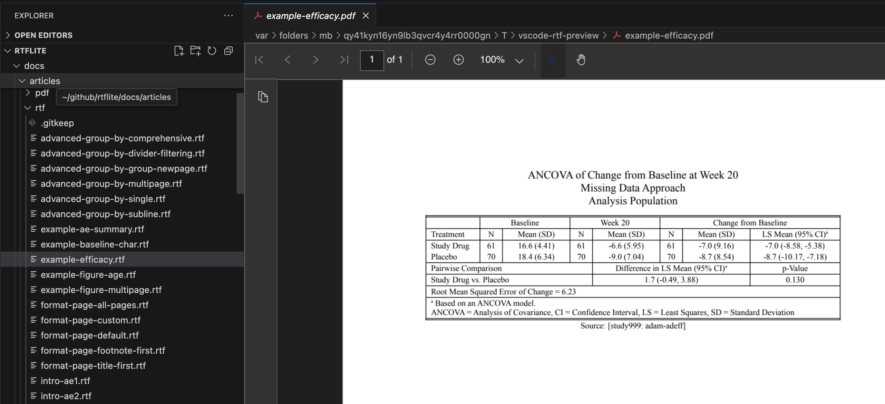

# RTF Preview for VS Code

Preview RTF files directly in VS Code by converting them to PDF using LibreOffice.

## Features

- Preview RTF files as PDF within VS Code.
- Automatic detection of LibreOffice installation.
- Configurable path to LibreOffice executable.

## Requirements

- **LibreOffice**: This extension requires LibreOffice to be installed on your system to convert RTF files to PDF.
  - **macOS**: `brew install --cask libreoffice`
  - **Linux**: `sudo apt install libreoffice` (Debian/Ubuntu)
  - **Windows**: Download and install from [libreoffice.org](https://www.libreoffice.org/)

## Extension Settings

This extension contributes the following settings:

* `rtfPreview.libreOfficePath`: Path to the LibreOffice executable (`soffice`). If left empty, the extension will attempt to auto-detect it.